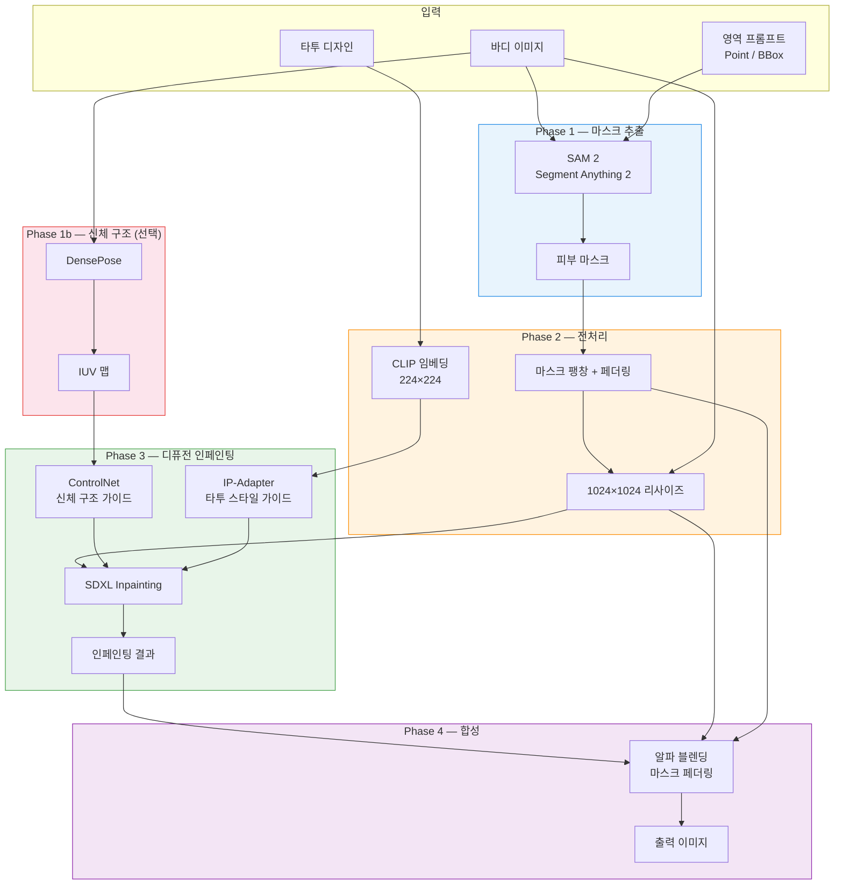
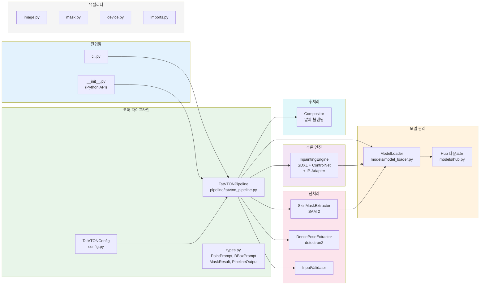
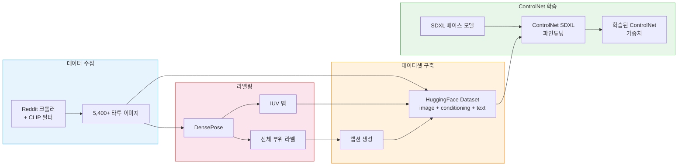

# TatVTON — Tattoo Virtual Try-On

**SAM 2** 마스크 추출과 **SDXL Inpainting + ControlNet + IP-Adapter** 합성을 이용한 사실적인 타투 합성.

바디 사진, 타투 디자인, 타겟 영역을 입력하면 피부 텍스처, 조명, 신체 윤곽을 보존하면서 타투를 자연스럽게 합성한 결과를 생성합니다.

**[English](./README.md)**

## 아키텍처

### 추론 파이프라인



### 모듈 구조



### 학습 파이프라인 (Colab)



## 데이터셋

HuggingFace Hub에 큐레이팅된 타투 이미지 데이터셋을 제공합니다:

**[rlaope/tatvton-tattoo-raw](https://huggingface.co/datasets/rlaope/tatvton-tattoo-raw)** — Reddit에서 크롤링한 5,400+ 타투 이미지, CLIP으로 품질 필터링 (피부 위 타투 검증). 6개 신체 부위 x 12가지 스타일.

## 설치

```bash
pip install -e .
```

SAM 2 (별도 설치 필요):

```bash
pip install "sam-2 @ git+https://github.com/facebookresearch/sam2.git"
```

DensePose 지원 (선택):

```bash
pip install -e ".[densepose]"
```

개발 도구:

```bash
pip install -e ".[dev]"
```

## 빠른 시작

### Python API

```python
from PIL import Image
from tatvton import TatVTONPipeline, PointPrompt

body = Image.open("body.jpg")
tattoo = Image.open("tattoo.png")

pipe = TatVTONPipeline()
result = pipe(
    body_image=body,
    tattoo_image=tattoo,
    region=PointPrompt(coords=[(300, 400)]),
)
result.image.save("output.png")
```

### CLI

```bash
# 포인트 프롬프트
tatvton body.jpg tattoo.png --point 300,400 -o output.png

# 바운딩 박스 프롬프트
tatvton body.jpg tattoo.png --bbox 100,150,400,600 -o output.png

# 여러 포인트 + 옵션
tatvton body.jpg tattoo.png --point 300,400 --point 350,420 \
    --steps 20 --strength 0.9 --seed 42 -o output.png

# 마스크와 원본 인페인팅 결과도 저장
tatvton body.jpg tattoo.png --point 300,400 --save-mask --save-raw
```

모듈로도 실행 가능:

```bash
python -m tatvton body.jpg tattoo.png --point 300,400
```

### CLI 옵션

| 옵션 | 설명 | 기본값 |
|------|------|--------|
| `body` | 바디 이미지 경로 (필수) | - |
| `tattoo` | 타투 디자인 이미지 경로 (필수) | - |
| `--point X,Y` | 포인트 프롬프트 (반복 가능) | - |
| `--bbox X1,Y1,X2,Y2` | 바운딩 박스 프롬프트 | - |
| `-o, --output` | 결과 저장 경로 | `output.png` |
| `--resolution` | 파이프라인 해상도 | 1024 |
| `--steps` | 추론 스텝 수 | 30 |
| `--strength` | 인페인팅 강도 | 0.85 |
| `--guidance-scale` | 가이던스 스케일 | 7.5 |
| `--ip-adapter-scale` | IP-Adapter 스케일 | 0.6 |
| `--seed` | 랜덤 시드 | 랜덤 |
| `--device` | cuda / cpu / mps | cuda |
| `--offload` | none / model / sequential | model |
| `--save-mask` | 마스크 이미지 저장 | - |
| `--save-raw` | 원본 인페인팅 결과 저장 | - |

## 설정

세 가지 수준의 설정:

| 수준 | 방법 | 예시 |
|------|------|------|
| 기본값 | `TatVTONPipeline()` | 12 GB GPU 최적화 |
| Config | `TatVTONPipeline(TatVTONConfig(resolution=768))` | 세션 단위 |
| 호출별 | `pipe(..., strength=0.95, seed=42)` | 호출 단위 |

## 요구 사항

- Python 3.9+
- PyTorch 2.0+
- NVIDIA GPU 12+ GB VRAM (권장)

## 라이선스

MIT
