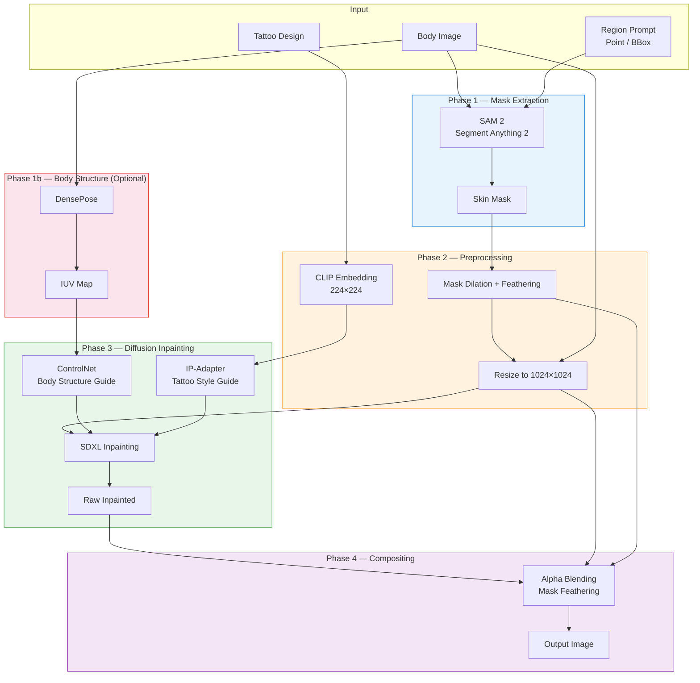
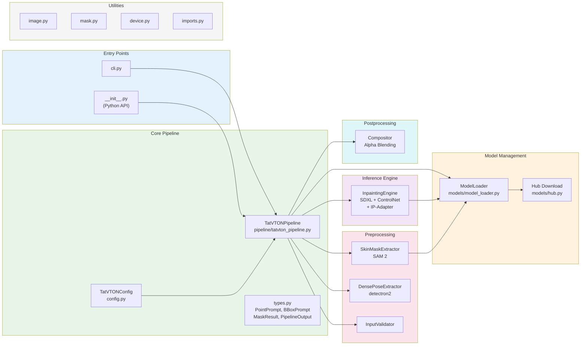
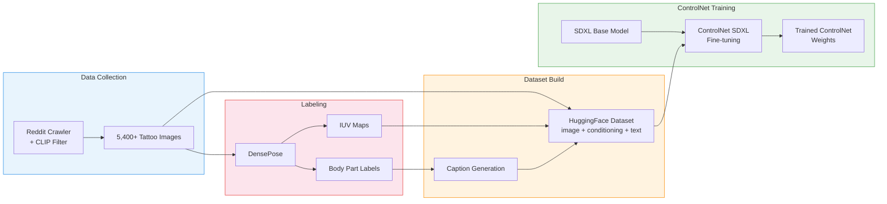

# TatVTON — Tattoo Virtual Try-On

Realistic tattoo compositing on body photos using **SAM 2** mask extraction and **SDXL Inpainting + ControlNet + IP-Adapter** synthesis.

Given a body photo, a tattoo design, and a target region, TatVTON generates a photorealistic result with the tattoo naturally blended onto the skin — preserving skin texture, lighting, and body contours.

**[한국어](./README.ko.md)**

## Architecture

### Inference Pipeline



### Module Structure



### Training Pipeline (Colab)



## Dataset

We provide a curated tattoo image dataset on HuggingFace Hub:

**[rlaope/tatvton-tattoo-raw](https://huggingface.co/datasets/rlaope/tatvton-tattoo-raw)** — 5,400+ tattoo images crawled from Reddit, filtered with CLIP for quality (tattoo-on-skin verification). Covers 6 body parts x 12 styles.

## Installation

```bash
pip install -e .
```

SAM 2 (installed separately):

```bash
pip install "sam-2 @ git+https://github.com/facebookresearch/sam2.git"
```

With DensePose support (optional):

```bash
pip install -e ".[densepose]"
```

Development tools:

```bash
pip install -e ".[dev]"
```

## Quick Start

### Python API

```python
from PIL import Image
from tatvton import TatVTONPipeline, PointPrompt

body = Image.open("body.jpg")
tattoo = Image.open("tattoo.png")

pipe = TatVTONPipeline()
result = pipe(
    body_image=body,
    tattoo_image=tattoo,
    region=PointPrompt(coords=[(300, 400)]),
)
result.image.save("output.png")
```

### CLI

```bash
# Point prompt
tatvton body.jpg tattoo.png --point 300,400 -o output.png

# Bounding box prompt
tatvton body.jpg tattoo.png --bbox 100,150,400,600 -o output.png

# Multiple points + options
tatvton body.jpg tattoo.png --point 300,400 --point 350,420 \
    --steps 20 --strength 0.9 --seed 42 -o output.png

# Save mask and raw inpainted result too
tatvton body.jpg tattoo.png --point 300,400 --save-mask --save-raw
```

You can also run via module:

```bash
python -m tatvton body.jpg tattoo.png --point 300,400
```

### CLI Options

| Option | Description | Default |
|--------|-------------|---------|
| `body` | Path to body image (required) | - |
| `tattoo` | Path to tattoo design image (required) | - |
| `--point X,Y` | Point prompt (repeatable) | - |
| `--bbox X1,Y1,X2,Y2` | Bounding box prompt | - |
| `-o, --output` | Output path | `output.png` |
| `--resolution` | Pipeline resolution | 1024 |
| `--steps` | Inference steps | 30 |
| `--strength` | Inpainting strength | 0.85 |
| `--guidance-scale` | Guidance scale | 7.5 |
| `--ip-adapter-scale` | IP-Adapter scale | 0.6 |
| `--seed` | Random seed | random |
| `--device` | cuda / cpu / mps | cuda |
| `--offload` | none / model / sequential | model |
| `--save-mask` | Save mask image | - |
| `--save-raw` | Save raw inpainted result | - |

## Configuration

Three levels of configuration:

| Level | Method | Example |
|-------|--------|---------|
| Defaults | `TatVTONPipeline()` | 12 GB GPU optimised |
| Config | `TatVTONPipeline(TatVTONConfig(resolution=768))` | Session-wide |
| Per-call | `pipe(..., strength=0.95, seed=42)` | Call-specific |

## Requirements

- Python 3.9+
- PyTorch 2.0+
- NVIDIA GPU with 12+ GB VRAM (recommended)

## License

MIT
